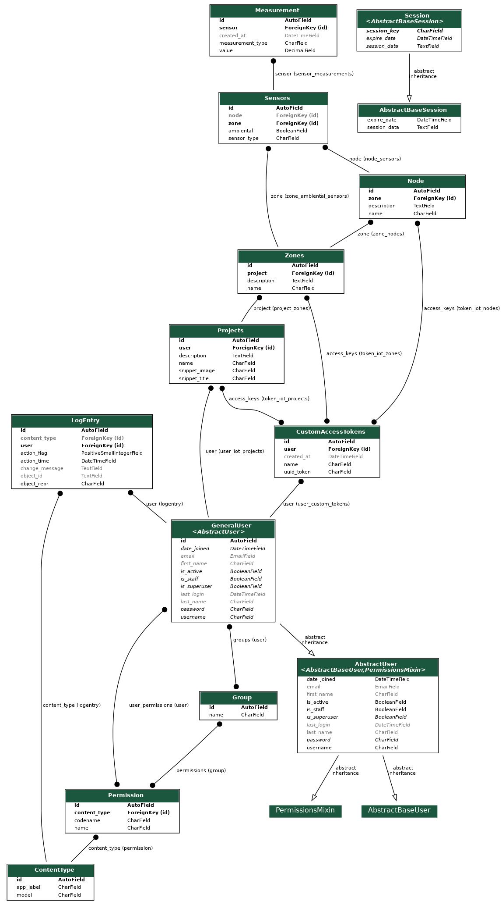

# Models:
#### General aspects:
All models can have multiple acces tokens, allowing managment of read and write actions.

* ### Project:
    * Belongs to a user
    * Manages Zones
    * Has a name
    * Has a description
    * Has a snippet title and image in order to facilitate frontend development
* ### Zones:
    * Belongs to a Project
    * Manages:
        * Ambiental sensors
        * Nodes
    * Has a name
    * Has a description
* ### Nodes:
    * Belongs to a Zone
    * Manages node sensors
    * Has a name
    * Has a description
* ### Sensors:
    * Belongs to a Zone
    * *Might belong to a Node*
    * *Might be ambiental*
    * Has a type
        * This types can be modified inside the `model_choices.py` file
* ### Measurements:
    * Belong to a sensor
    * Has a type:
        * This types can be modified inside the `model_choices.py` file
    * Has a value
    * Has a `created_at` timestamp
        * It's set automatically when a new record is created
        * **If the time does not match your current timezone please change the `TIME_ZONE` parameter inside `backend.settings.py`**

### Models relationship:

* A user can have **N** tokens which might belong to **N** Projects, Zones or Nodes.
* Each Project can have **N** Zones
* Each Zone can have **N** Nodes & **N** Ambiental Sensors
* Each Node can have **N** Sensors
* Each Sensor might have **N** Measurements with different types

# Plot views:
**IMPORTANT!** *As of current version there's no validation on who can see the plots*

### General aspects:
*All of the plot views return an image created from a `matplotlib.pyplot plot`, and all of the views require a project id*

### Views information
Inside the `views.py` file you will find 3 view classes, this classes accomplish different functions:
* `sensor_graph`:
    * Plots all measurements from a sensor
    * If some measurement types have different amount of measurements they'll be presented in different plots inside the same image

* `graph`:
    * Plots all measurments of a type from a sensor
    * Single type plot, thus no mismatching dimentions

* `graph_mixed`
    * Plots all measurments of a type from all sensors in a zone
    * If some sensor measurements have different amount of measurements they'll be presented in different plots inside the same image